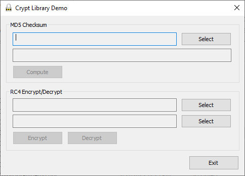

In simple terms, cryptography is the application of selected processes for encoding data so that the information can be stored and transmitted securely. The Microsoft  `CryptoAPI` allows developers to build cryptographic security into their applications by providing a flexible set of functions to encrypt or digitally sign data. You can use cryptography to achieve many security requirements, including:

- Ensuring secrecy by coding sensitive files so that an interloper cannot understand them;
- Guaranteeing secure communications even though the transmission media is not secure;
- Verifying the origin of messages and data using digital signatures.

The fundamental cryptographic operations supported by the  `CryptoAPI` are encryption, decryption, and signing. Encryption is somewhat like controlled fragmentation: the data is there, but it’s scattered according to the encryption rules. Decryption is simply the inverse of encryption, where the encryption rules are reversed to reassemble the data. Digital signing is analogous to physically hand-signing a document, but with one significant improvement: it is very, very difficult to forge a digital signature.  [Here](https://learn.microsoft.com/en-us/windows/win32/seccrypto/cryptography-portal?redirectedfrom=MSDN) you can find more about this subject.

The main implementation is done in  _CryptographyExt.h_  and  _CryptographyExt.cpp_  files, as follows:
- `bool GetChecksumBuffer(ALG_ID nAlgorithm, LPBYTE lpszOutputBuffer, DWORD& dwOutputLength, LPBYTE lpszInputBuffer, DWORD dwInputLength);` computes hash code for the given binary buffer, using the specified algorithm;
- `bool GetChecksumString(ALG_ID nAlgorithm, CString& strResult, CString strBuffer);` computes hash code for the given  `CString`, using the specified algorithm;
- `bool GetChecksumFile(ALG_ID nAlgorithm, CString& strResult, CString strPathName);` computes hash code for the given file, using the specified algorithm;
- `bool EncryptBuffer(ALG_ID nAlgorithm, LPBYTE lpszOutputBuffer, DWORD& dwOutputLength, LPBYTE lpszInputBuffer, DWORD dwInputLength, LPBYTE lpszSecretKey, DWORD dwSecretKey);` encrypt the given binary buffer, using the specified algorithm;
- `bool EncryptFile(ALG_ID nAlgorithm, CString strOutputName, CString strInputName, LPBYTE lpszSecretKey, DWORD dwSecretKey);` encrypt the given file, using the specified algorithm;
- `bool DecryptBuffer(ALG_ID nAlgorithm, LPBYTE lpszOutputBuffer, DWORD& dwOutputLength, LPBYTE lpszInputBuffer, DWORD dwInputLength, LPBYTE lpszSecretKey, DWORD dwSecretKey);` decrypt the given binary buffer, using the specified algorithm;
- `bool DecryptFile(ALG_ID nAlgorithm, CString strOutputName, CString strInputName, LPBYTE lpszSecretKey, DWORD dwSecretKey);` decrypt the given file, using the specified algorithm;
- Helper function for secret key:  `CString GetComputerID();`.
